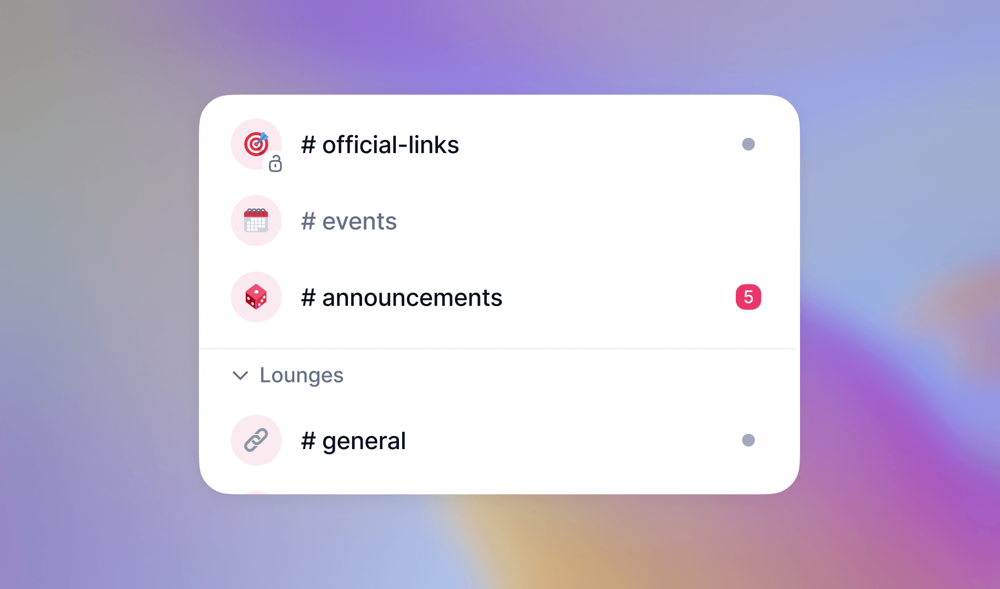
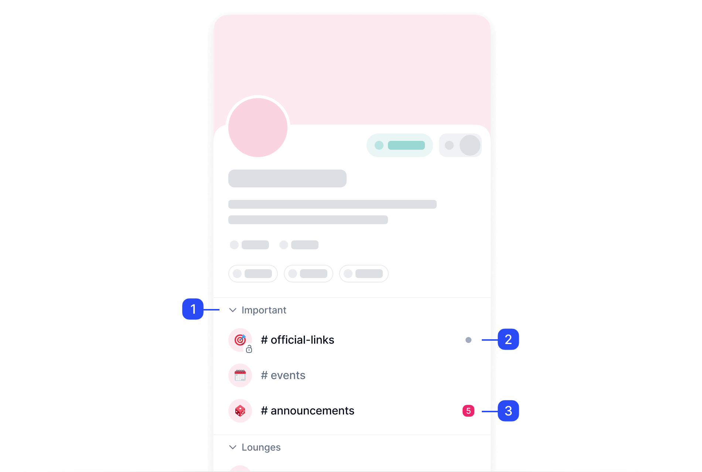
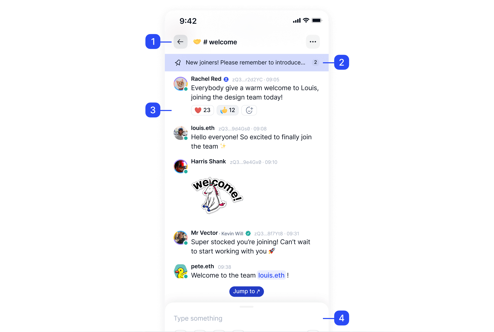
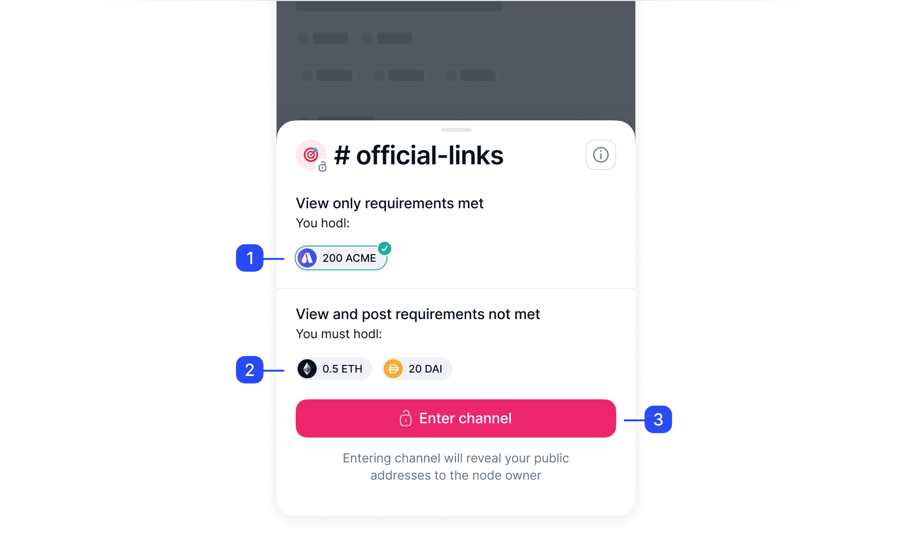

# Channels: your quick start guide

A channel in Status is a dedicated conversation space within a community centered around a particular topic. Community members can [join](./join-a-channel.md) and [leave](./leave-a-channel.md) these channels at their convenience.

!!! note
    Messages in [token-gated communities][how-to-use-communities-your-quick-start-guide] and token-gated channels are always end-to-end encrypted.

As a community owner, you can use channels to break down a large community into smaller, more focused sub-groups. With Status, you can [configure channel permissions][configure-channel-permissions] based on token ownership. For example, [you can make an open channel token-gated][set-up-a-token-gated-channel], only allowing holders of specific tokens to join.

=== ":mobile-one: Categories"
    Community owners can group related channels into [categories][create-a-channel]. This is especially useful for communities with a lot of channels.

=== ":mobile-two: New messages"
    A dot next to the channel name indicates unread messages. To customize your channel notifications, check out [Configure community and channel notifications][configure-community-and-channel-notifications].

=== ":mobile-three: Channel notifications"
    A number next to the channel name indicates the number of unread mentions. To customize your mention notifications, check out [Customize mentions and other messages][customize-mentions-and-other-messages].

!!! tip
    To add channels to your community, check out [Create a channel][create-a-channel].

## Channel screen

Let's break down the main user interface elements in a channel screen.

=== ":mobile-one: Channel information"
    [Token-gated channels][set-up-a-token-gated-channel] show a :mobile-locked-lock: lock symbol next to the channel icon. You can select :mobile-more-options: **More options** to view other channel information, such as channel members, permissions or notifications settings.

=== ":mobile-two: Pinned messages"
    The community owner and admins can [pin messages][pin-a-message] to this area, such as announcements, FAQ or channel rules. Channel members can pin messages when the [`Any member can pin a message` option][customize-your-community] is enabled.

=== ":mobile-three: Channel feed"
    This area shows the channel activity, including messages, photos, stickers, reactions and links.

=== ":mobile-four: Message field"
    From here, you can send messages to channel members with [text][send-and-read-messages], [images][share-images-in-status] or emojis, as well as [audio messages][send-an-audio-message].

## Open and token-gated channels

All members in a [Status Community][how-to-use-communities-your-quick-start-guide] can enter, browse and post messages in open channels. For token-gated channels, members should [meet the token requirements][understand-token-requirements-in-channels] and hold the required tokens at all times.

=== ":mobile-one: View-only requirements"
     View-only requirements show the tokens users should hold to enter the channel and read the messages. When the user meets the requirements for a token, the token shows a :mobile-green-check: green checkmark.

=== ":mobile-two: View and post requirements"
    Community owners can also set view and post channel requirements. In this example, the user meets the view-only requirements but doesn't meet the view and post ones.

=== ":mobile-three: Enter channel"
    The :mobile-unlocked-lock: **Enter channel** option is only available when the user meets at least one of the requirements: view-only, view and post, or both.

!!! tip
    Token-gated channels show a :mobile-locked-lock: lock symbol next to the channel icon.

## The #general channel

All communities start with a default `#general` channel. You can use this channel for various purposes, including sharing news, discussing community policies and events, or making announcements.

This channel works like any other channel. As a community owner or admin, here's how you can make this channel more helpful:

- Don't rename the channel. The `#general` channel is widely recognized and understood in communities. Renaming the channel may confuse members.
- [Set up permissions][configure-channel-permissions] to restrict who can post in `#general`. This removes noise from the channel and keeps it on topic.
- Use the `#general` channel to [pin messages][pin-a-message] describing FAQs, community rules or other information relevant to your community.

--8<-- "includes/urls-en.txt"
