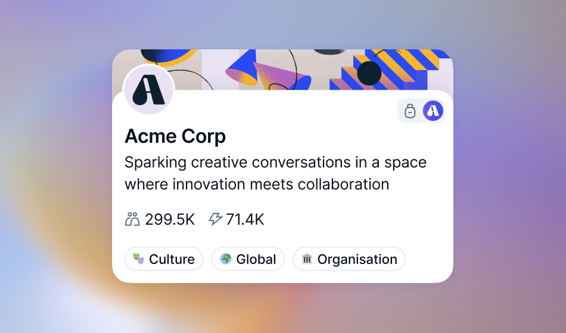
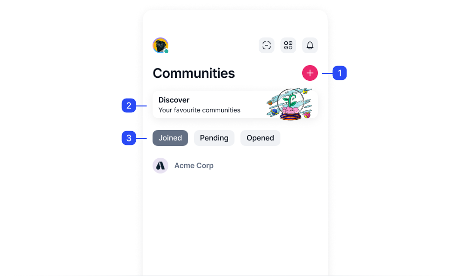
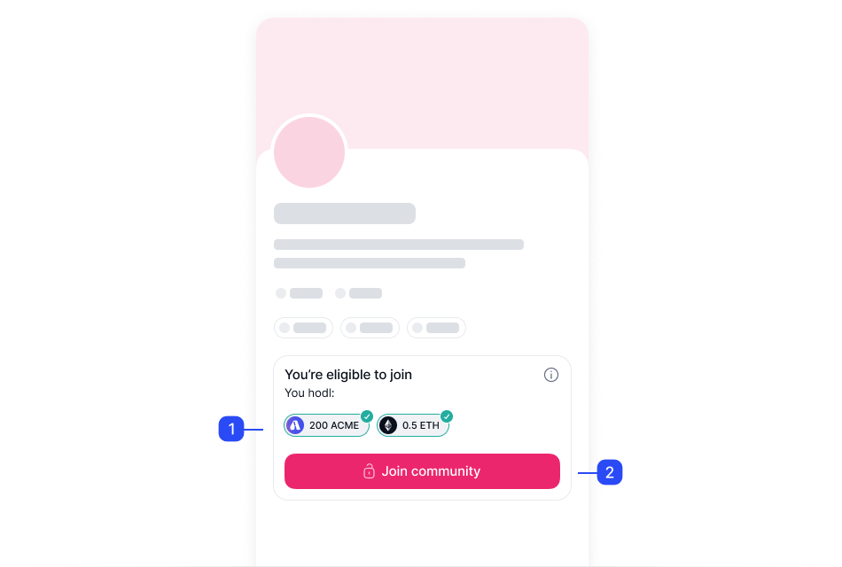
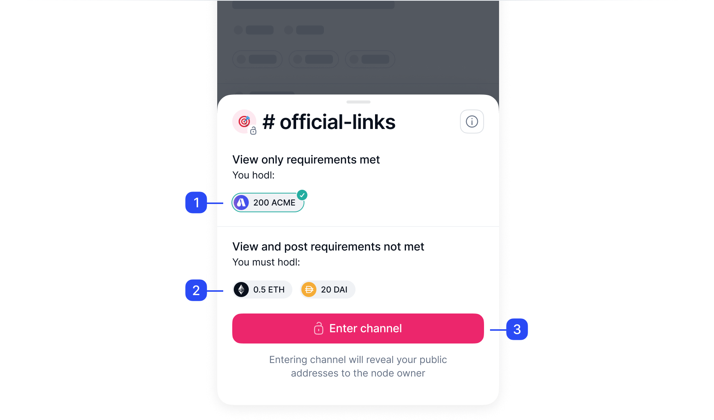

# How to use Status Communities: your quick start guide

The Status app combines a privacy-first [messaging app][about-status-messages], a non-custodial [crypto wallet][status-wallet-your-quick-start-guide] and a [web3 browser][how-to-use-status-browser-your-quick-start-guide] to interact with dApps. At the core of Status' messaging are communities.

With Status Communities, you can create, join and engage in groups centred around shared interests or topics. You can [create your community][create-a-status-community] or [become part of an existing one][join-a-status-community].

!!! note
    Status Communities are decentralized and self-sovereign. This means owners control their communities, not Status. We've built the platform, but control is in your hands. For more information, check out [What is Status][about-status].

## Discover Communities

When you open the Status app, the :mobile-communities: Communities option in the tab bar brings the list of communities where you participate. You can also discover new communities to join in the community directory.

=== ":mobile-one: Create or import communities"

    In the Communities screen, use :mobile-add-blue: **Add** to can [create a new community][create-a-status-community] or [import a community][import-a-community-someone-shares-with-you] someone shares with you via a link, QR code or the community's public key.

=== ":mobile-two: Discover"

    The **Discover** option brings the community directory, with the list of [public communities][about-the-different-types-of-status-communities] you can join. These communities may have token and join requirements set by the community owner. For more information, check out [About the different types of Status Communities][about-the-different-types-of-status-communities].

=== ":mobile-three: Communities list"

    These tabs show the communities you interact with. The **Joined** tab shows the communities where you participate. You can also select **Pending** to see the communities you are waiting to join, or **Opened** to see the communities you visited but didn't join.

!!! tip
    [Private communities][about-the-different-types-of-status-communities] are hidden and don't appear in the community directory. To join these communities, you need to [import them to your profile][import-a-community-someone-shares-with-you].

## Join communities and channels

In Status, community owners have complete control over how users join their communities and can restrict access [using tokens][token-based-access-to-communities-and-channels].

In token-gated communities, members must own and maintain the required tokens to join and participate in the community. In addition to token requirements, community owners may require [manual approval to join][about-community-request-approvals] their communities.

=== ":mobile-one: Token requirements"

    Token-gated communities require specific tokens and token amounts to join. When you hold the necessary tokens, a :mobile-green-check: green checkmark appears next to the token. Check out [Understand token requirements in communities][understand-token-requirements-in-communities] for more information.

=== ":mobile-two: Join community"

    In token-gated communities, the :mobile-unlocked-lock: **Join community** option is active only when you meet the token requirements.

!!! note

    When you join a token-gated community, your tokens work as proof of ownership and stay in your Status Wallet. They are not transferred to the community owner, Status or someone else.

Status Communities contain [channels][channels-your-quick-start-guide]. Think of channels as rooms, each with a unique theme, helping keep discussions focused and organized.

Community owners can also control [access to channels using tokens][create-a-token-gated-channel] or other permissions. Some channels might be open to all members, while others can be restricted or read-only.

=== ":mobile-one: View only requirements"

    Token-gated channels require specific tokens and token amounts to join and read the channel. When you hold the necessary tokens, a :mobile-green-check: green checkmark appears next to the token.

=== ":mobile-two: View and post requirements"

    Owners can configure different view-only and view and post requirements for channels. 

=== ":mobile-two: Enter channel"

    If you meet some or all of the channel requirements, the :mobile-unlocked-lock: **Enter channel** option is active and you can join the conversation.

!!! tip
    Use your [notification settings][configure-community-and-channel-notifications] to customize the community and channel notifications.

## Communities' privacy and security

When you participate in a channel, your messages are visible to anyone with access to the same channel. In communities or channels, you don't see [the users you have blocked][block-or-unblock-someone-in-status], but a blocked user can still see messages you send in the community.

!!! note
    Your Status profile is visible to anyone in Status, and you can customize [what information others can see][view-your-profile-as-someone-else] in your profile.

Your communication in channels is encrypted and available only to the channel members. Status messaging uses decentralized peer-to-peer (P2P) technology and strong end-to-end (E2EE) encryption to ensure the privacy and security of your communication.

In a token-gated community, only those possessing the required tokens can access the community's content. No outside party (not even Status) can gain access to or view the community's exchanges and interactions.

## Losing access to communities

Only the community owners regulate access to their communities, not Status. After you join a community, its owner can [kick you out or ban you][kick-or-ban-someone-from-your-community] from the community at their discretion.

You can also lose access to token-gated communities or channels when you no longer hold the [required tokens][understand-token-requirements-in-communities].

*[dApps]: A dApp (or decentralized application) is software that runs on a decentralized network (such as the blockchain). dApps are not controlled by any single entity, and their operations are transparent and immutable.

--8<-- "includes/urls-en.txt"
