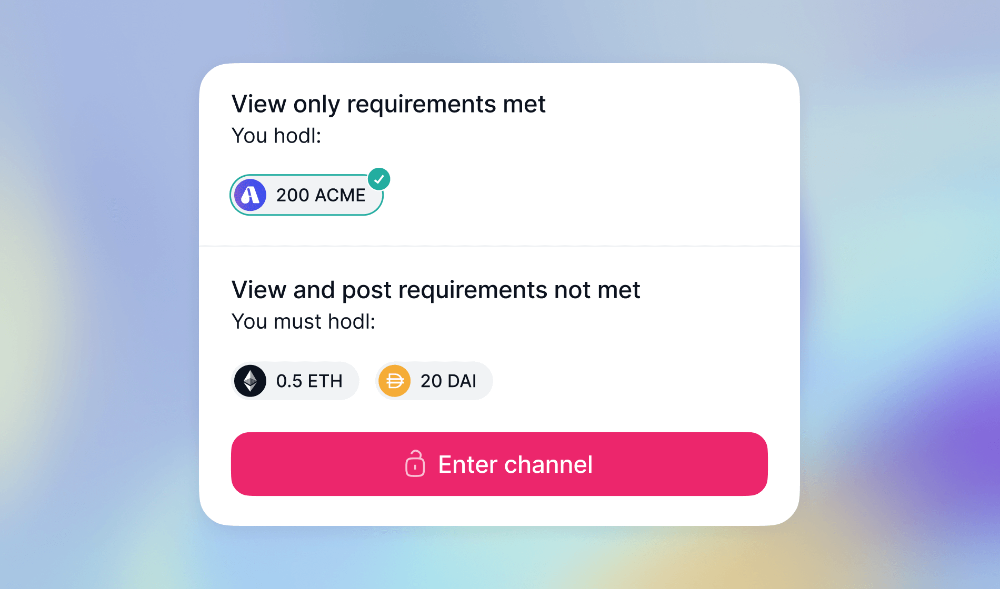

# Set up a token-gated channel

!!! note ""
    Currently, you can only set up token-gated channels using Status desktop. [:octicons-desktop-download-16: Download Status desktop][status-web-download]

By default, a new [community channel][channels-your-quick-start-guide] is open and available for everyone to join, view and post new messages. As a community owner, you can restrict community members' actions in channels using [tokens][understand-coins-and-tokens] (assets, collectibles or ENS names).

!!! tip
    Token-gated channels show a :mobile-locked-lock: lock symbol next to the channel icon.

In a token-gated channel, only token holders can participate. You might require members to hold specific tokens to join the channel, or you can set up a [view-only channel][set-up-a-view-only-channel] where only members owning certain tokens can write.

!!! warning "Caution"
    Setting up token-gated channels has immediate effects. Any new permission automatically removes channel members who don't meet the token requirements. Before setting up token-gated channels, read [Prevent member removal when you set up token-based permissions][prevent-member-removal-when-you-set-up-token-based-permissions].

A token-gated channel can be useful in various scenarios. For instance, if you offer premium content or services, a token-gated channel can be an exclusive space for your subscribers. You can also use tokens to create a view-only channel for community announcements where you want the conversation to stay relevant. For more information, check out [Set up a view-only channel][set-up-a-view-only-channel].

!!! note
    You can use token-gated channels and communities independently. For example, you may want to set up an open Status Community but restrict access to certain channels.

## What to expect

- You can set up `View only` and `View and post` token-based channel permissions together or independently.
- If you create separate `View only` and `View and post` token permissions, anyone who meets the `View and post` permission can see the channel and send messages, even if they don't meet the `View only` rules.
- You can set up token-based permissions with existing tokens or [tokens mint][mint-tokens-for-your-community] and distribute via [airdrops][how-to-airdrop-tokens-in-status]. You can combine up to five assets, collectibles or ENS names in a single permission.
- Channel members must always meet and keep the token requirements in a token-gated channel. Members not holding the required tokens lose access to the channel automatically.
- Remove the channel permissions to change a token-gated channel back into an open one. For more information, check out [Change a token-gated channel into an open one][change-a-token-gated-channel-into-an-open-one].

## Set up a token-gated channel

=== "Desktop"

    1. From the navigation sidebar, click your community.
    1. On top of the channel sidebar, click your community logo and then click **Permissions** and **Add new permission**.
    1. For the `Who holds` variable, select the tokens and amounts (for assets and collectibles) members must hold and click **Add**.
    1. For the `Is allowed to`, under the **Channels** area, choose :desktop-edit-boxed: **View and post** or :desktop-view: **View only**.
    1. For the `In` variable, check the box for the channel where you want to add the permission. You can check the appropriate box to use the same permission across multiple channels.
    1. Optionally, check :desktop-hide: **Hide permission** to hide this permission from members who don't meet the token requirements.
    1. Click **Create permission**. The new permission takes effect immediately.

!!! tip
    Tokens are linked by `AND` operators. This means the permission takes effect when the holder owns all the tokens. If you want to use the `OR` operator instead, create additional permissions with different `Who holds` values.

--8<-- "includes/urls-en.txt"
