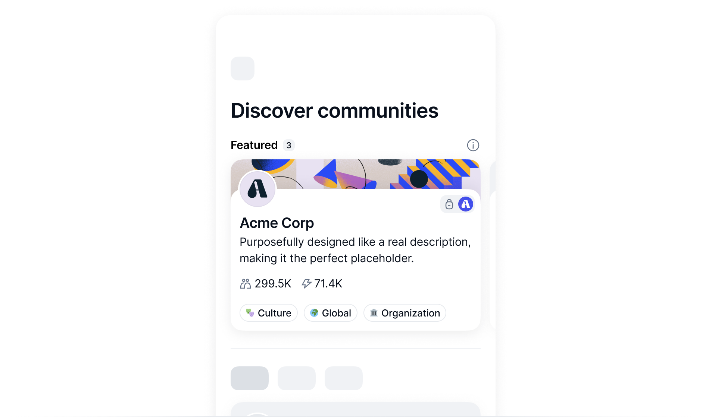

# Vote to feature a Status Community

If you're passionate about a community and wish for more people to discover it, you can vote for it to be featured in Status app.

Up to five top communities get a spot in the Featured section in Communities, making them more visible to everyone.

## What to expect

- All SNT holders, not just community members or Status users, can participate in the voting.
- Votes happen on the [Community Directory Curation dApp :octicons-tab-external-16:][curate.status.app].
- Your voting power is determined by how many SNT tokens you stake. You don't spend the tokens to vote, but you must hold the tokens you stake during the [verification][verify-the-vote] and [finalization][finalize-the-vote] periods.
- You should pay a [gas fee][understand-network-fees] in ETH for initiating, validating and finalizing a vote.

!!! note
    Status does not charge you any fees for voting.

A round of vote involves five steps. These steps are not required for every voter.

| Voting step | Who can participate | Gas fee required |
|:---|:---|:---|
| 1. [Connect your wallet][connect-the-wallet] | Any SNT holder | No |
| 2. [Initiate a voting process][initiate-voting] | Any SNT holder, at least one person | Yes |
| 3. [Cast your vote][cast-the-vote] | Any SNT holder | No |
| 4. [Verify the vote][verify-the-vote] | Any SNT holder, at least one person | Yes |
| 5. [Finalize the vote][finalize-the-vote] | Any SNT holder, at least one person | Yes |

!!! tip
    To know more about the dApp and the rules of each step, check out [About voting to change community visibility][about-voting-to-change-community-visibility].

## Step 1: Connect your wallet {: #connect-the-wallet}

Make sure you open the [Community Directory Curation dApp :octicons-tab-external-16:][curate.status.app] and your wallet contains enough SNT for voting and ETH to pay for the gas fees.

The process is for Status Wallet, but you can also try other wallets like MetaMask.

1. Open your wallet and switch the network to Optimism.
1. Open the dApp and select **Connect** from the top navigation.
1. From your wallet, confirm to connect.

!!! note
    You may need to connect your wallet again when you revisit the dApp depending on your browser settings.

## Step 2: Initiate a round of vote {: #initiate-voting}

If you don't see the Finalize weekly featured button at the top of the Directory section in the dApp, you can start a new voting round. Otherwise, someone must [finalize the vote][finalize-the-vote] first.

A round of vote starts when the first voter [cast a vote][cast-the-vote].

## Step 3: Cast your vote {: #cast-the-vote}

The voting period lasts for five days. You can find the communities you like in the Directory section of the dApp and vote.

1. From the top navigation of the dApp, select **Directory** to view all public communities.
1. Find the community you want to vote for and select **Feature this community!**
1. Choose the amount of SNT to stake and select **Confirm vote to feature communtiy**.
1. From your wallet, sign the vote.

## Step 4: Verify the vote {: #verify-the-vote}

After voting, a two-day verification period begins for identifying valid votes. If no one verifies the vote within this period, only the first vote of this round is counted.

1. From the top navigation of the dApp, select **Directory**.
1. Select **Verify Weekly Featured**.
1. From your wallet, confirm and pay the gas fee.

## Step 5: Finalize the vote {: #finalize-the-vote}

After the verification period, at least one person must finalize the vote for it to reach a result. Otherwise, the current round of vote stays pending and no one can initiate a new round.

1. From the top navigation of the dApp, select **Directory**.
1. Select **Finalize Weekly Featured**.
1. From your wallet, confirm and pay the gas fee.

!!! note
    After the finalization period, up to five communities with the highest number of SNT tokens are showcased in the Featured section.

--8<-- "includes/urls-en.txt"
