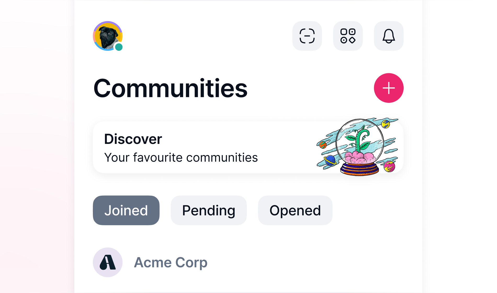

# Vote to make a community private or public

A voting process determines whether a community is public or private. A public community appears on the [Discover page][find-communities-to-join] in Communities, while a private community does not.

## What to expect

-  All SNT holders, not just community members or Status users, can participate in the voting.
- Votes happen on the [community directory curation dApp :octicons-tab-external-16:][curate.status.app].
- Your voting power is determined by how many SNT tokens you stake.
- You don't spend the tokens to vote, but you must hold the tokens you stake during the [verification][verify-the-vote] and [finalization][finalize-the-vote] periods.

!!! note
    Status does not charge you any fees for voting.

Voting involves five steps. These steps are not required for every voter.

| Voting step | Who can participate | Gas fee required |
|:---|:---|:---|
| 1. [Connect your wallet][connect-wallet] | Any SNT holder | No |
| 2. [Initiate a voting process][initiate-vote] | Any SNT holder, at least one person | Yes |
| 3. [Cast your vote][cast-vote] | Any SNT holder | No |
| 4. [Verify the vote][verify-vote] | Any SNT holder, at least one person | Yes |
| 5. [Finalize the vote][finalize-vote] | Any SNT holder, at least one person | Yes |

!!! tip
    To know more about the dApp and the rules of each step, check out [About voting to change community visibility][about-voting-to-change-community-visibility].

## Step 1: Connect your wallet {: #connect-wallet}

Make sure you open the [Community Directory Curation dApp :octicons-tab-external-16:][curate.status.app] and your wallet contains enough SNT for voting and ETH to pay for the gas fees.

The process is for Status Wallet, but you can also try other wallets like MetaMask.

1. Open your wallet and verify the Optimism network is checked.
1. Open the dApp and select **Connect** from the top navigation.
1. Select **Confirm** in your wallet.

!!! note
    You may need to connect your wallet again when you revisit the dApp depending on your browser settings.

## Step 2: Initiate a voting process {: #initiate-vote}

Initiate a vote if there isn't an ongoing vote for the community you want to add or remove. If there is an ongoing vote, [cast your vote][cast-vote].

### Initiate a vote for adding a community to Discover

You need the [community's public key][import-a-community-someone-shares-with-you].

1. From the top navigation of the dApp, select **Votes**.
1. Select **Propose community**.
1. Enter the community's public key.
1. Choose the amount of SNT to stake and select **Confirm vote to add community**.
1. Select **Create vote to add community**.
1. From your wallet, confirm and pay the gas fee.

### Initiate a vote for removing a community from Discover

1. From the top navigation of the dApp, select **Directory**.
1. Find the community you want to remove and select :desktop-delete: **Delete** next to the community name.
1. Choose the amount of SNT you want to stake for voting and select **Confirm vote to remove community**.
1. From your wallet, confirm and pay the gas fee.

## Step 3: Cast your vote {: #cast-vote}

The voting period lasts for 14 days.

1. From the top navigation of the dApp, select **Votes**.
1. Find the community you want to vote for and select **Don't add** or **Add** for adding, or **Keep** or **Remove** for removing.
1. Choose the amount of SNT to stake.
1. Select **Vote to not add community** or **Vote to add community** for adding. Select **Vote to keep community** or **Vote to remove community** for removing.
1. From your wallet, sign the vote.

## Step 4: Verify the vote {: #verify-vote}

After voting, a seven-day verification period begins for identifying valid votes.

1. Open the dApp and find the vote to verify.
1. Select **Verify the vote**.
1. From your wallet, confirm and pay the gas fee.

## Step 5: Finalize the vote {: #finalize-vote}

After the verification period, at least one person must finalize the vote for it to reach a result.

1. Open the dApp and find the vote to finalize.
1. Select **Finalize the vote**.
1. From your wallet, confirm and pay the gas fee.

!!! note
    After finalization, the community is added or removed from Discover based on the voting result.

--8<-- "includes/urls-en.txt"
