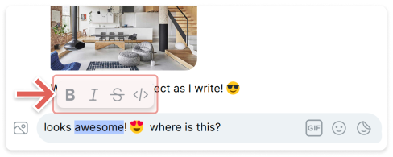

# Format your messages

You can format text inside your messages to clarify or emphasize information. Formatting can make your communication more effective, especially for long messages.

In Status, you format your messages using the formatting toolbar or markup by surrounding the text with special characters.

!!! note
    The formatting options are not available in Status Web.

## Formatting toolbar

To format your text using the formatting toolbar, select the text and choose the desired formatting option. You can also format a message you've already sent by [editing the message][edit-delete-messages]. The formatting toolbar is only available in the Status desktop app.



!!! tip
    When you press ++return++ in Status desktop, your message is sent. If you want to start a new line, press ++shift+return++

## Markup

You can use markup options to format your text in the Status desktop and mobile app.

| Format | Markup | Example | Result |
|:---|:---|:---|:---|
| bold | Surround your text with double asterisks | \*\*your message\*\* | **your message** |
| italic | Surround your text with single asterisk or underscores | \*your message\*</br>\_your message\_ | *your message* |
| strikethrough | Surround your text with tildes | \~~your message\~~ | ~~your message~~ |
| quoted text | Add a pipe (vertical bar) in front of your text | `|your quoted message | |your quoted message |
| code | Surround your text with backticks | \`your code\` | `your code` |
| code block | Add three backticks before and after the code block | \```your code</br>block\``` | ```your code```</br>```block``` |

--8<-- "includes/urls-en.txt"