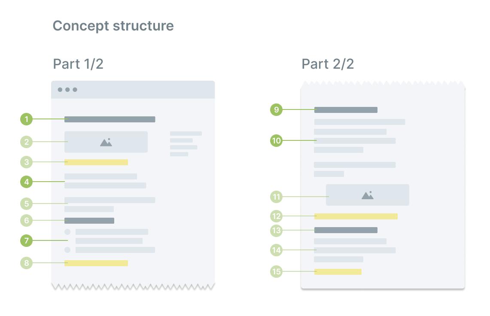
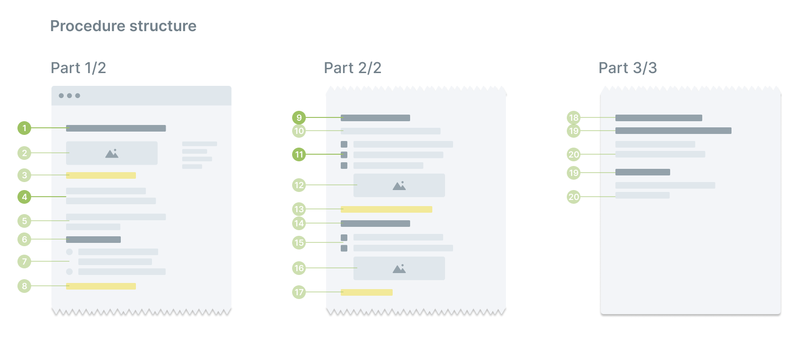
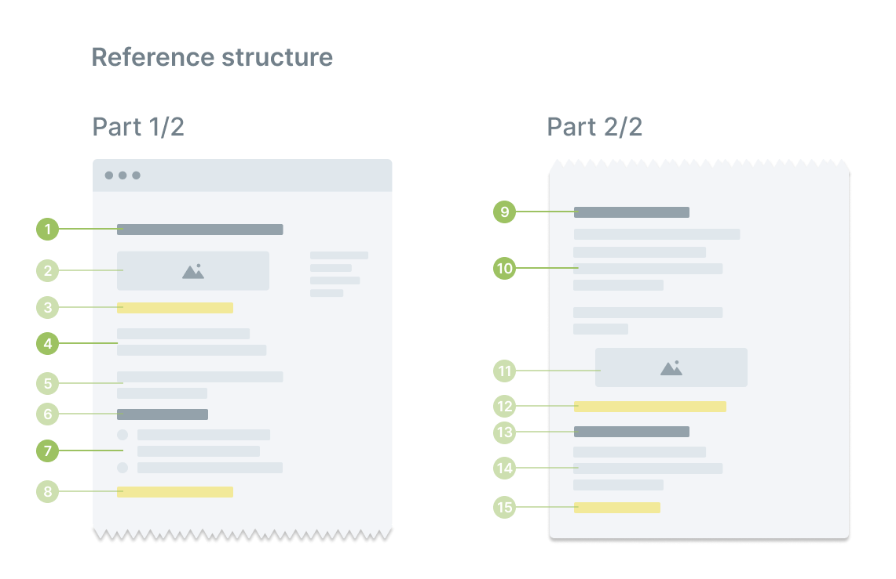

# Structuring the content

This document provides guidelines to create easy-to-read and follow topics for the Status user documentation.

!!! note
    This document is a work in progress!

## Guidelines

- Keep it short. Articles between 300-400 words are easy to read and support the user's workflow. Shorter articles are OK, but articles beyond 500 words are not. If necessary, split the information into different articles.
- Each paragraph has a single purpose and describes a single concept. Avoid mixing concepts in the same paragraph or repeating the same information in different sections.
- When there is more than one way to do something or describe something, use the most straightforward way only. Don't discuss all the possible ways.
- Use admonitions selectively and strategically. Documents with multiple admonitions are harder to read. Add the information as a regular sentence if you use more than three admonitions in your document.

## Types of documents

Status user documentation topics fall into one of these categories:

- [Concept](#concept-help-me-to-understand): help me to understand
- [Procedure](#procedure-help-me-do): help me to do
- [Reference](#reference-help-me-remember): help me to remember
- [Guide](#guide-help-me-to-do-multiple-related-tasks): help me to do multiple related tasks.

    !!! note
        A guide consists of two or more procedures in a single document.

## Concept: help me to understand

Concept articles describe a product's functionality. They complete procedures and provide non-procedural information.

A user minting an NFT, for example, may not be interested in understanding the interactions with the Ethereum blockchain. For this user, explaining how to mint an NFT is sufficient. Others, however, may wish to understand this process in more detail, so a concept article on minting NFTs satisfies their curiosity.

Status documentation aims to guide users in completing tasks and motivate them to explore the different features and functionalities. Therefore, concepts topics are not as common as procedural topics.

A list of frequently asked questions (FAQs) falls under the concept category.

### Concept structure

| Element | # | Style | Required | Notes |
|:--|:--|:--|:--|:--|
| Title | 1 | H1 | **Yes** |  |
| Screenshot | 2 | PNG / GIF | No | The screenshot shows the area in the app related to the concept. |
| Admonition | 3 | Admonition | No | This admonition is exclusively to alert readers about the feature availability. For example, a feature is only available to specific application role or available after completing another task. |
| Introduction | 4 | Paragraph | **Yes** | A brief discussion of the concept. |
| Example | 5 | Paragraph | No | An example explaining the concept in context. |
| "The basics" title | 6 | H3 | **Yes** | H3 title reads "The basics." |
| "The basics" list | 7 | Unordered list | Yes | A list summarizing the article's main takeaways. |
| Admonition | 8 | Admonition | No | General notes, tips, or warnings about the topic. |
| Explanation title | 9 | H2 | **Yes** |  |
| Explanation | 10 | Paragraph | **Yes** | One or more paragraphs describing the concept in detail |
| Explanation screenshot | 11 | PNG / GIF | No | One or more screenshots providing context for the reader. |
| Explanation admonition | 12 | Admonition | No | Notes, tips, or warnings about the topic. |
| Explanation subtitle | 13 | H3 | No | When the main explanation requires a longer description, split the information into different subtitles |
| Subtitle screenshot | 14 | PNG / GIF | No | One or more screenshots providing context for the reader. |
| Subtitle admonition | 15 | Admonition | No | Notes, tips, or warnings about the task. |

### Concept title

- Concept titles should avoid any confusion with procedure titles.
- Do not start with an action verb or use the *-ing* form of a verb.

| Usage       | Example                                        |
|:------------|:-----------------------------------------------|
| **Correct** | Guide to communities administration            |
| Incorrect   | Manage your Status community                   |
| **Correct** | Understand your Status community statistics    |
| Incorrect   | Understanding your Status community statistics |
| **Correct** | About minting NFTs                             |
| Incorrect   | Minting NFTs                                   |
| **Correct** | FAQ: Import data from Discord                  |
| Incorrect   | Importing data from Discord                    |

### Writing concepts

Use the [Style conventions](./style-conventions.md) in this style guide to writing your concepts. Check out some of the concepts in the Status Help website to get a better sense of how to create content.

## Procedure: help me do

A procedure describes how to complete an action using a series of steps. Procedures help users to use and discover the Status app and are the core of our documentation. These are the main characteristics of procedures in Status documentation:

- Procedures are split into two different parts. The first part (on top) includes reference (non-procedural) information, while the second part includes procedural information.
- Non-procedural descriptions must be short and to the point. If the functionality requires further discussion, use an additional [concept article](#concept-help-me-to-understand).
- A procedure explains a single task and, if necessary, additional subtasks. If the task is complex, consider splitting it into different procedures and, optionally group them into a [guide](#guide-help-me-to-do-multiple-related-tasks).
- For tasks that may cause an error (like, for example, changing a password, choosing a user name, or sending crypto) consider adding a *Common questions* section at the end of the article, with answers to the most common issues. If the list of possible errors for a specific task is too long, use a [FAQ](#concept-help-me-to-understand) (concept) article instead.

### Procedure structure

### **Procedure title**

- Focus on the result, not on the task.
- Start the title with an action verb in the imperative form. Don't use the *-ing* form of the verb.

    | Usage       | Example                              |
    |:------------|:-------------------------------------|
    | **Correct** | Delete a group conversation          |
    | Incorrect   | Deleting a group conversation        |
    | **Correct** | Add new members to your Community    |
    | Incorrect   | Adding new members to your Community |

- A title should contain the name of the action and *how* or *where* the action occurs. Avoid using titles with one or two words.

    | Usage       | Example                               |
    |:------------|:--------------------------------------|
    | **Correct** | Configure your notifications settings |
    | Incorrect   | Notifications                         |
    | Incorrect   | Notification settings                 |
    | **Correct** | Invite new members to your Community  |
    | Incorrect   | Invite new members                    |

- Be specific on the task's goal and, if possible, avoid empty verbs like *make*, *manage*, or *put*.

    | Usage       | Example                                 |
    |:------------|:----------------------------------------|
    | **Correct** | Administer your Status Community tokens |
    | Incorrect   | Manage your Status Community tokens     |
    | **Correct** | Create an NFT for your Community        |
    | Incorrect   | Make an NFT for your Community          |

### **Writing tasks**

- On the first step, tell the user where to start.
- Follow the [UI elements guidelines](./style-conventions.md#ui-elements) to describe the user interactions.

    !!! note
        For clarity purposes, the UI elements on these examples use a regular typeface.

- Use words consistently when describing user actions. For example, if you use *remove* in one step, don't use *clear*, *empty* or another synonym in a different step.
- Don't describe to users what's happening on the screen, unless the result is unexpected.

    | Usage | Example |
    |:--|:--|
    | **Correct** | 1. Click Change. 2. On the Options dialog, uncheck the Automatic box. |
    | Incorrect | 1. Click Change. A new Options dialog opens. 2. On this dialog, uncheck the Automatic box. |

- Use one step for each user action. It's OK to combine simple actions into a single step.
- Limit the procedure to a maximum of six steps. If you need more steps to explain the task, split the steps into a subtask.
- Don't use sublists inside lists; instead, use a new list on a subtask.
- When certain action occurs in a specific menu or area in the user interface, write the location before the action.

    | Usage       | Example                                                |
    |:------------|:-------------------------------------------------------|
    | **Correct** | From the Status Settings, change your profile picture. |
    | Incorrect   | Change your profile picture in the Status Settings.    |
    | **Correct** | In Available tokens, tap Change token.                 |
    | Incorrect   | Tap Change token in the Available tokens menu.         |

- Write the result of the action first and then, the condition for the result.

    | Usage       | Example                                                                           |
    |:------------|:----------------------------------------------------------------------------------|
    | **Correct** | You can see the blue badge after you successfully complete mutual authentication. |
    | Incorrect   | After you complete mutual authentication, you can see the blue badge.             |
    | **Correct** | To remove the user from your contact list, tap Block user.                        |
    | Incorrect   | Tap Block user to remove the user from your contact list.                         |

- Don't use links within a task, except when you need to reference a related subtask in the same article.

## Reference: help me remember

Reference articles provide data that supports users as they perform a task. A reference article can be related to a procedure or work independently. Examples of reference topics are:

- A list of parameters
- A list of shortcuts
- Configuration settings

### Reference structure

Because of its nature, reference topics are mostly based on lists and tables.

| Element | # | Style | Required | Notes |
|:--|:--|:--|:--|:--|
| Title | 1 | H1 | **Yes** |  |
| Admonition | 2 | Admonition | No | This admonition is exclusively to alert readers about the feature availability. For example, a setting is only available to specific application roles or available after completing a task. |
| Introduction | 3 | Paragraph | **Yes** | A brief discussion of the topic. |
| Admonition | 4 | Admonition | No | General notes, tips, or warnings about the topic. |
| Reference title | 5 | H2 | **Yes** |  |
| Explanation | 6 | Paragraph | **Yes** | One or more paragraphs describing the reference. |
| Reference table or list | 7 | Table / list | **Yes** | A table or bullet list with the relevant information. This can also be included after the reference subtitle. |
| Reference admonition | 8 | Admonition | No | Notes, tips, or warnings about the reference. |
| Reference subtitle | 9 | H3 | No | When the main explanation requires a longer description, split the information into different subtitles |
| Subtitle table or list | 10 | PNG / GIF | **Yes** | A table or bullet list with the relevant information. |
| Subtitle admonition | 11 | Admonition | No | Notes, tips, or warnings about the reference. |

### Reference title

Use these rules as a guideline for naming reference topics:

- Omit the verb in the sentence.
- Name the Status component the reference is about and then, the information it includes.
- Avoid meta-descriptions, like *list of [...]*, *table of [...]*, *a description of [...]*, and others.
- Use the *reference* word, if necessary.

Examples:

| Usage       | Example                                     |
|:------------|:--------------------------------------------|
| **Correct** | Status messages types                       |
| Incorrect   | Table of the Status messages types          |
| **Correct** | Status Wallet settings                      |
| Incorrect   | A description of the Status Wallet settings |
| **Correct** | Community settings reference                |
| Incorrect   | List of Community settings                  |

## Guide: help me to do multiple related tasks

[ToDo]

 [:octicons-git-branch-24: Contribute to our docs][contributors-guide]{ .md-button } 

--8<-- "includes/urls-style-guide.txt"